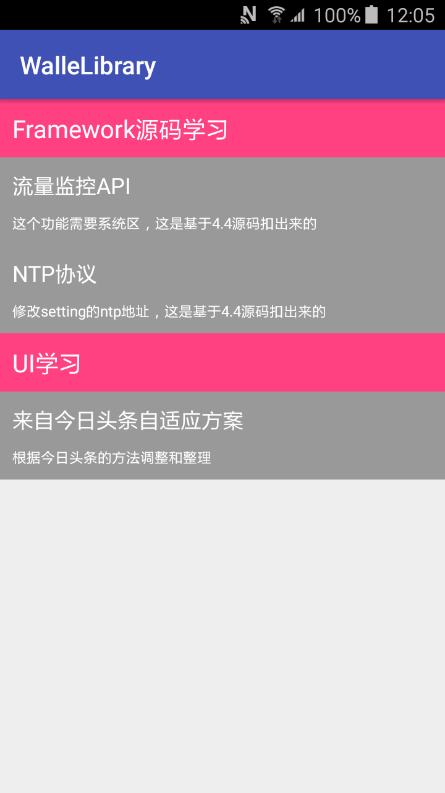

# WalleLibrary
- 开发一个兼容库，可start，我会持续更新
- [目录结构说明](https://github.com/moz1q1/WalleLibrary/blob/master/doc/main.md)

# 学习站点
- [Android Blog 周刊 ](http://androidblog.cn/)工具汇总，源码汇总等
- [Android官网不用翻墙的那种，你懂得](https://developer.android.google.cn/)
- [泡在网上的日子](http://www.jcodecraeer.com/)
- [hongyang的wanandroid](http://www.wanandroid.com/)
- [androiddevtools](http://www.androiddevtools.cn/)
- [Android官方架构组件:Lifecycle详解&原理分析](https://blog.csdn.net/mq2553299/article/details/79029657)

# 值得学习
1.httpdns
- [Android端打开HttpDns的正确姿势](https://www.jianshu.com/p/b0c154215b48)
- [阿里HTTPDNS](https://help.aliyun.com/product/30100.html)
- [腾讯HTTPDNS](https://cloud.tencent.com/product/hd)
- [新浪HTTPDNS](https://github.com/CNSRE/HTTPDNSLib)

2.http2.0和spdy协议
- [如何优雅的谈论HTTP／1.0／1.1／2.0](https://www.jianshu.com/p/52d86558ca57)
- [SPDY、HTTP/2、QUIC协议](https://blog.csdn.net/hursing/article/details/22785475/)

3.okhttp原理
- [android面试题-okhttp内核剖析](https://www.jianshu.com/p/9ed2c2f2a52c)
- [终于找到了一篇一看就懂的 OKHttp 原理解析](https://blog.csdn.net/lanxingfeifei/article/details/64442574)

4.Android适配
- [Android 屏幕适配教程、适配机制介绍](https://www.jianshu.com/p/a92530c9d0cd)
- [Android 目前最稳定和高效的UI适配方案](https://www.jianshu.com/p/a4b8e4c5d9b0)
- [一种极低成本的Android屏幕适配方式](https://mp.weixin.qq.com/s/d9QCoBP6kV9VSWvVldVVwA)

5.其他
- [Android adb bugreport工具分析和使用](https://blog.csdn.net/createchance/article/details/51954142)

# 个人学习计划
- Android架构组件Lifecycle、LiveData、ViewModel
